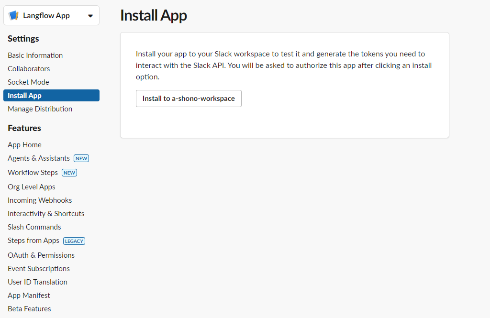
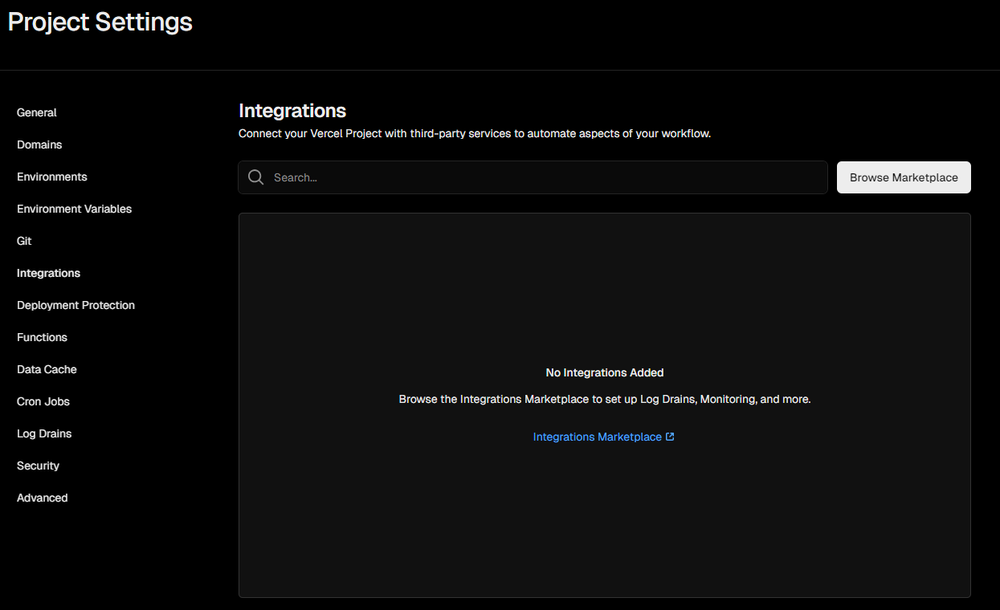

# Langflow Slackbot

## 機能

[DataStax Astra](https://astra.datastax.com)上の Langflow で構築した AI ワークフローを SlackBot にメンションするだけでチャットすることができる．

以下のリポジトリを参考にして作成した。
https://github.com/vercel/examples/tree/main/solutions/slackbot

## 使用技術

- Typescript
- Vercel
- Prisma
- Neon

## デプロイ

### Slackbot 作成

- 以下にアクセスして、新しく Slack App を作成する
  https://api.slack.com/apps

- 以下の manifest からアプリを作成する．
  slackapp/manifest.json

- アプリの設定画面より Workspace にインストールする．
  Setting > Install App



- OAuth トークンを控える
  インストール後、同ページに"Bot User OAuth Token"が表示されるのでメモする．
  .env の`SLACK_BOT_TOKEN`に設定する．

- アプリの設定画面より Signing Secret を確認する．
  Basic Information > App Credentials
  .env の`SLACK_SIGNING_SECRET`に設定する．

### Neon で DB 作成

[Neon](https://console.neon.tech/app/projects)よりプロジェクトを作成する．
DB 名などは任意で OK．

### Vercel で API のデプロイ

- [Vercel](https://vercel.com)で新規プロジェクトを作成する．
  本リポジトリを自身の Github アカウントに Fork 等して Vercel プロジェクトにインポートする．

- プロジェクトのダッシュボードより、Setting タブに遷移する．

- Integrations より、MarketPlace から Neon を探す．
  

- Neon のインテグレーションでアカウントを接続する．
  https://vercel.com/marketplace/neon

- Vercel のプロジェクト Setting タブに戻り、Environment Variables を設定する．
  事前に確認している、`SLACK_BOT_TOKEN`と`SLACK_SIGNING_SECRET`を設定する．
  設定されていなければ、`DATABASE_URL`も Neon のコンソールからデータベース URL 確認して設定する．

- Vercel プロジェクト画面から、再度デプロイする
  ・・・ > Create Deployment

- Slackbot 設定
  - Vercel のプロジェクトホームからドメイン(例では https://<example-endpoint.vercel.app>)を確認する．
  - Slack アプリ設定画面から Event Subscription と Interactivity & Shortcuts の Request URL をそれぞれ以下のように設定する．
    - "event_subscriptions":
      "request_url": "https://<example-endpoint.vercel.app>/api/events"
    - interactivity":
      "request_url": "https://<example-endpoint.vercel.app>/api/action"

### ローカル開発

[Vercel CLI](https://vercel.com/docs/cli)と[ngrok](https://dashboard.ngrok.com/get-started/setup/linux)を使用して、このプロジェクトをローカルでテストする：

```sh
pnpm i -g vercel
pnpm vercel dev --listen 3000 --yes
```

```sh
ngrok login
ngrok http 3000
```

[Slack イベントの有効化](./README.md/#enable-slack-events)の際に、`ngrok` URL にサブスクリプション URL を変更してください。
